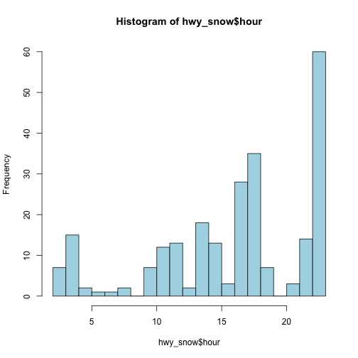

---
title: "Predicting Road Safety from Twitter"
author: "Winston Saunders"
date: "Dec 2014"
output: html_document
---

#####Analysis of winter road safety probabilities for Santiam Pass, Oregon_

###Summary

The [Oregon Dept of Transportation](https://tripcheck.com/Pages/Twitter.asp) regularly publishes, as a public service, live road reports via Twitter. The record created by these tweets is a great public service since drivers can get real time information about road conditions.  

However, this data can also be repurposed to recontruct events on specific sections of road over a longer baseline and to correlate them with road conditions, etc. for statistical analysis. That is the purpose of this analysis.

This analysis can benefit drivers. The "average" citizen has today few ways to learn or benefit from historical data about road safety. However, as better navigation tools and even self-driving cars become available, analysis of historical data may not only improve travel times, but might also be used to improve travel safety through the choice of driving routes, driving time, or avoiding certain road conditions.

This article seeks to understand whether twitter data can be used for this purpose and to develop a predictive machine learning algorithm.

Analysis focuses on a specific location, US Highway 20 at Santiam Pass, a 4800 foot (1450 meters) mountain pass in the Cascade Range (milepost 79) of Oregon. As the main route from the Central Oregon city of Bend to the Willamette Valley cities of Portland, Eugene, and Salem, Highway20 has high traffic year round and is the site of [frequent](http://www.nuggetnews.com/archives/960717/front1.shtml) accidents. 

This analysis use historical data from Twitter to understand the correlation of accidents on this specific section of road to reported snowy road conditions. 

###Getting the Tweets

The twitter feed for this analysis is downloaded by a separate R program (Since I could not get RStudio to allow me to enter the required security features during runtime execution). The data are stored as a .csv of Tweets locally. 


##Data Cleaning


```
##               created
## 1 2014-12-08 02:27:53
## 2 2014-12-06 17:50:07
## 3 2014-12-06 14:37:53
## 4 2014-12-05 04:29:52
## 5 2014-12-04 23:11:57
## 6 2014-12-04 20:37:54
##                                                                                                                                        text
## 1 US20, 2 Mi W of Sisters, Unconfirmed, An unconfirmed report of hazardous debris has been received, use caution.... http://t.co/s1f3BTuwPv
## 2                                                                             US20, sisters, Slush or snow pack, ... http://t.co/gtTlhjPFCJ
## 3                                                                                      US20, sisters, Black ice, ... http://t.co/gtTlhjPFCJ
## 4                                                                                      US20, sisters, Black ice, ... http://t.co/gtTlhjPFCJ
## 5                                                                             US20, sisters, Slush or snow pack, ... http://t.co/gtTlhjPFCJ
## 6                                      US20, @ Spicer Drive, Delay &lt; 20min, A crash has occurred, use caution.... http://t.co/ZVDGiBoCKo
```

```
##               created
## 1 2014-12-08 02:27:53
## 2 2014-12-06 17:50:07
## 3 2014-12-06 14:37:53
## 4 2014-12-05 04:29:52
## 5 2014-12-04 23:11:57
## 6 2014-12-04 20:37:54
##                                                                                                                                        text
## 1 US20, 2 Mi W of Sisters, Unconfirmed, An unconfirmed report of hazardous debris has been received, use caution.... http://t.co/s1f3BTuwPv
## 2                                                                             US20, sisters, Slush or snow pack, ... http://t.co/gtTlhjPFCJ
## 3                                                                                      US20, sisters, Black ice, ... http://t.co/gtTlhjPFCJ
## 4                                                                                      US20, sisters, Black ice, ... http://t.co/gtTlhjPFCJ
## 5                                                                             US20, sisters, Slush or snow pack, ... http://t.co/gtTlhjPFCJ
## 6                                      US20, @ Spicer Drive, Delay &lt; 20min, A crash has occurred, use caution.... http://t.co/ZVDGiBoCKo
##         date hour  chronsecs dayperiod
## 1 2014-12-08    2 1418034473         4
## 2 2014-12-06   17 1417917007         3
## 3 2014-12-06   14 1417905473         2
## 4 2014-12-05    4 1417782592         1
## 5 2014-12-04   23 1417763517         4
## 6 2014-12-04   20 1417754274         4
```

The data analyzed cover the dates from 2012-02-26 to 2014-12-08. There are 2000 tweets during this period. 

Data are cleaned by searching the text for the strings "crash" and "snow" and then filtered for location "Santiam Pass Summit". A few instances of cleaned and engineered date are shown above.


## Data Analysis


```
## [1] "US20, 3 Mi W of Santiam Pass Summit, Delay &lt; 20min, A crash has occurred, use caution.."
## [2] "US20, Santiam Pass Summit, Delay &lt; 20min, A crash has occurred, use caution.... http://"
## [3] "US20, 2 Mi W of Santiam Pass Summit, Delay &lt; 20min, A crash has occurred, use caution.."
## [4] "US20, 2 Mi W of Santiam Pass Summit, Delay &lt; 20min, A crash has occurred, use caution.."
## [5] "US20, 3 Mi E of Santiam Pass Summit, Delay &lt; 20min, A crash has occurred, use caution.."
## [6] "US20, 5 Mi W of Santiam Pass Summit, Delay &lt; 20min, A crash has occurred, use caution.."
```

```
## [1] "US20, santiam pass smt, Slush or snow pack, Carry chains/Tra"
## [2] "US20, santiam pass smt, Packed snow, Carry chains/Traction t"
## [3] "US20, tombstone, Packed snow, Carry chains/Traction tires..."
## [4] "US20, santiam pass smt, Slush or snow pack, Carry chains/Tra"
## [5] "US20, santiam pass smt, Slush or snow pack, Carry chains/Tra"
## [6] "US20, santiam pass smt, Slush or snow pack, Carry chains/Tra"
```

    

###Data analysis and reduction

To analyze the data create a dataframe of dates from 2014-12-08 to 2012-02-26 and then add two binary columns, one for whether a crash occured that day and whether snow was reported on the road. A few rows of the dataframe are shown.


####Weekend


```
## 
##    Friday    Monday  Saturday    Sunday  Thursday   Tuesday Wednesday 
##        31        17        24        16         9        14         9
```

####Model features


```
##           date Accident Snow   weekday wkend
## 600 2013-04-18        0    0  Thursday     0
## 601 2013-04-17        1    0 Wednesday     0
## 602 2013-04-16        1    1   Tuesday     0
## 603 2013-04-15        1    1    Monday     0
## 604 2013-04-14        0    1    Sunday     0
## 605 2013-04-13        1    1  Saturday     1
## 606 2013-04-12        0    0    Friday     1
## 607 2013-04-11        0    0  Thursday     0
## 608 2013-04-10        0    0 Wednesday     0
## 609 2013-04-09        0    0   Tuesday     0
## 610 2013-04-08        1    1    Monday     0
## 611 2013-04-07        1    1    Sunday     0
## 612 2013-04-06        0    1  Saturday     1
## 613 2013-04-05        1    0    Friday     1
## 614 2013-04-04        0    0  Thursday     0
## 615 2013-04-03        0    0 Wednesday     0
```


```
## Waiting for profiling to be done...
```


Per this analysis in a period of 1017 days there were:    
• 131 accidents   
• 243 days with snow  
• 66 days with snow and accidents  

###Estimating Probabilities  

The specific rates can be derived from above:  
p<sub>Acc</sub> = 0.129 per day.   
p<sub>Snow</sub> = 0.239 per day.  
p<sub>SnowAcc</sub> = 0.065 per day.  

From these the conditional probabilities can be derived.  


p(Acc|Snow) = p<sub>SnowAcc</sub> / p<sub>Snow</sub> = 0.272

and  

p(Snow|Acc) = p<sub>SnowAcc</sub> / p<sub>Acc</sub> = 0.504  

Hence, the odds that an accident occurs on Santiam pass if snow is reported is 0.37:1, which are about half. 

The probability an accident occured given there was no snow is  

p(Acc|<span style="text-decoration: overline">Snow</span>) = (p<sub>Acc</sub> - p(Acc|Snow))/(1 - p<sub>Snow</sub>) = 0.08

which implies odd of 0.087:1 or one about one chance in 12.

This implies and odd ratio of 5.08

###Logistic Regression

We can use logistic regression to check odds 

###Odd ratios for the model


```
## Waiting for profiling to be done...
```

```
##                     OR      2.5 %    97.5 %
## (Intercept) 0.05108857 0.03572631 0.0710266
## Snow        5.36913760 3.58657216 8.0880039
## wkend       2.70467633 1.79197511 4.0843175
```

Hence according to the regression model 5.37 is the increase in odds from no snow to snow. 

Need to think about this one a bit...

###Time of Day

To look for correations with time of day need to simplify data to include only days with crashes (since it makes no sense to include a time of day for a day with no crash)


```r
require(ggplot2)
```

```
## Loading required package: ggplot2
```

```r
hist(hwy_df$hour, breaks = 24, col="lightblue")
```

 

```r
#tt<-hwy_df[hwy_df$hour<2|hwy_df$hour>4,]
#tt[1:30, c("created", "text", "hour", "hourdelta")]
```
  
###Conclusions

It appears twitter records can be used to understand road safety in a quantitative way.
The data show a significant correlation of road conditions to traffic safety, with an increase in the odds of an accident increasing nearly a factor of 12 when snowy conditions are reported. 

A next step in this anlaysis will be to use additional data features to improve prediction. 


